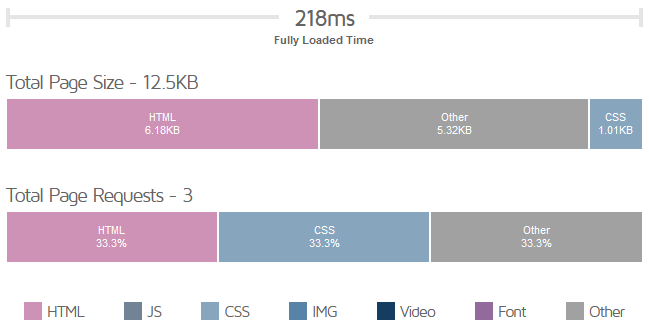

# The 12.51kB of pure HTML and CSS 
Or in other words, my current personal website I wrote in around 2 hours. 

This website is temporary. I need a website and this one has to do while I work on something else. I'll probably stick to the style of this one though, I grew to like it after some time.

The main inspiration for writing this website in a minimalist way was [The 512KB Club](https://512kb.club)  which has a list of some websites under 512kB. After looking at some of them I got really interested in optimization, or "how good can my website look while being as small as possible". You can view the full report from GTmetrix [here](https://gtmetrix.com/reports/sentiww.github.io/My7A2Kx7/).